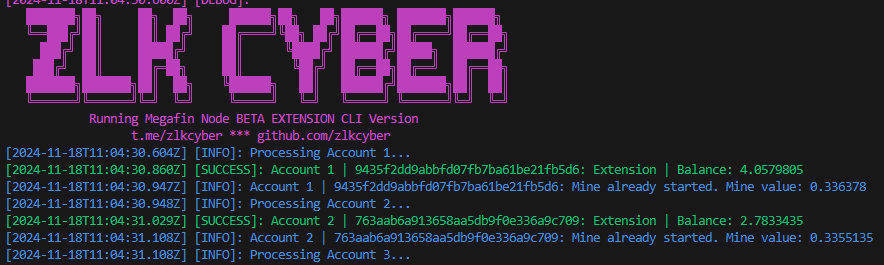

# MESHCHAIN 网络

MeshChain 是一个去中心化网络，旨在为 AI 工作负载提供经济且可扩展的计算能力。我们解决了 AI 资源的高成本和有限访问问题，使每个人都能更容易地贡献和受益于 AI 的力量。

- [https://app.meshchain.ai/](https://app.meshchain.ai?ref=IOVO3G77Q0QQ)


# MeshChain 自动化脚本

## 更新

- 使用 2Captcha 解决验证码 [https://2captcha.com/](https://2captcha.com/)

此仓库包含用于自动化任务的脚本，例如用户注册、电子邮件验证、领取奖励和在 MeshChain 上开始挖矿。

## 注意

- 这是来自 [https://github.com/Zlkcyber/mesh-bot](https://github.com/Zlkcyber/mesh-bot)的修改版，仅支持 socks5 代理,而且必须使用代理。在 register.js 里填入注册邀请码和 2Captcha key



## 功能

- 支持多个账户。
- 注册新账户（必须使用代理）。
- 使用 OTP 验证电子邮件。
- 领取水龙头 BNB。
- 初始化并链接唯一节点。

## 要求

- Node.js 16+
- 通过 `npm install` 安装依赖
- 每个账户需要一个新邮箱（用于电子邮件验证和领取水龙头 BNB）
- 每个账户只能链接一个 nodeId，所以如果你想要农场化操作，请创建多个账户。

## 文件

- 如果你使用脚本注册，此文件将自动生成
- 如果你已经有账户，可以手动创建文件
- `token.txt`：以 `access_token|refresh_token` 格式存储令牌，每行一个账户。
- 访问 [https://app.meshchain.ai/](https://app.meshchain.ai?ref=IOVO3G77Q0QQ) 并检查以获取 `access_token|refresh_token`
- 

- `unique_id.txt`：存储已链接节点的唯一 ID，每行一个账户。
- 检查 mesh 扩展以获取 ID
- 

## 使用方法

克隆仓库：

```bash
git clone https://github.com/Zlkcyber/mesh-bot.git
cd mesh-bot
```

安装依赖

```bash
npm install
```

注册账户

```bash
npm run register
```

运行机器人：

```bash
npm run start
```
